# Dungeon Tournament

**Dungeon Tournament** is a little Xcode RPG type game, playable in the console.

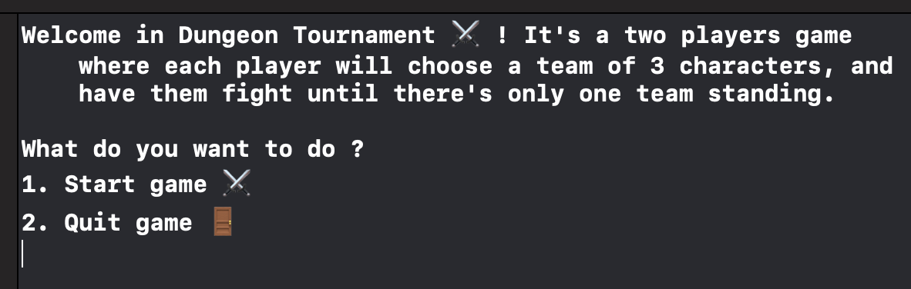 

## Rules

Two players are asked their name. Than, they will choose 3 characters each to compose their teams, name them, and fight in a turn-based combat system.

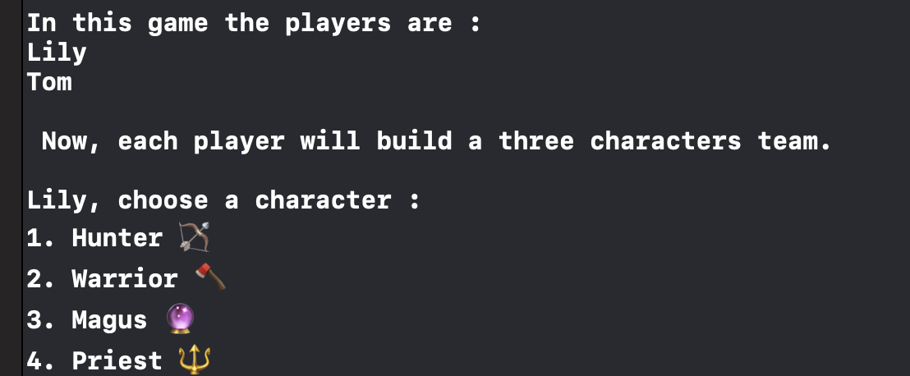 

First one to eliminate all of the other team damage dealers wins.

## Classes

Each player will choose 3 characters between 4 different classes :

- **Hunter 🏹** *(damage dealer)*
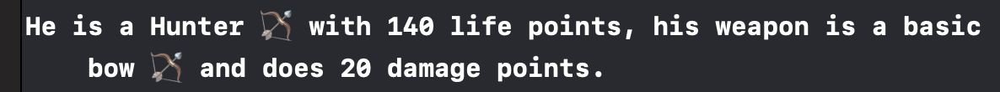 

- **Magus 🔮** *(damage dealer)*
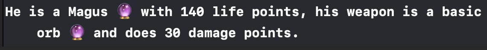 

- **Warrior 🪓** *(damage dealer)*
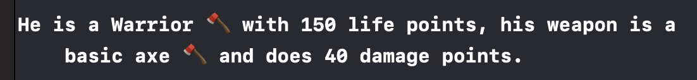

- **Priest 🔱** *(healer)*
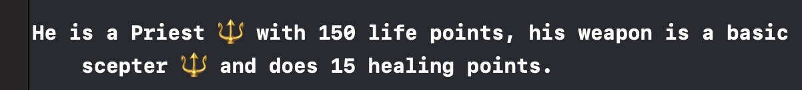

## Weapons

All characters start with their attributed basic weapon. This weapon could change throughout the game, but is always class based.

- **Bows 🏹**, Hunter's weapons  :
-- Inferior Bow : 15 damage points
-- Basic Bow : 20 damage points
-- Superior Bow :  25 damage points

- **Orbes 🔮**, Magus's weapons :
-- Inferior Orb : 25 damage points
-- Basic Orb : 30 damage points
-- Superior Orb :  35 damage points

- **Axes 🪓**, Warrior's weapons  :
-- Inferior Axe : 35 damage points
-- Basic Axe : 40 damage points
-- Superior Axe :  45 damage points

- **Scepter 🔱**, Priests's weapons  :
-- Inferior Bow : 10 damage points
-- Basic Bow : 15 damage points
-- Superior Bow :  20 damage points

## Random Chest

At the beginning of each round, a chest can randomly pop, granting the choosen character a new weapon based on its class, either better or worst than the one he had.

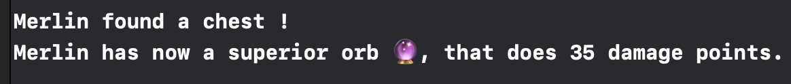
 
 

## Game

After each players finished to build their team, the teams are displayed :

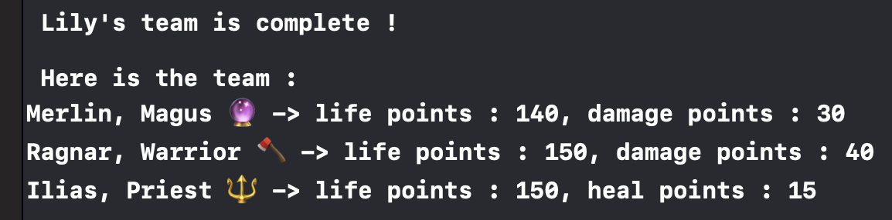 
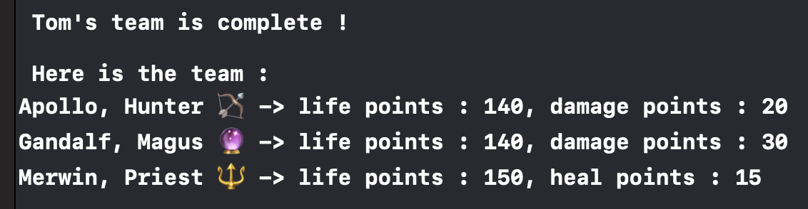

Then, the first player choose a character, then has access to its character menu  (either see its stats, or fight) :

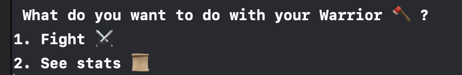

When fight is chosen, the player can choose which opponent to fight :

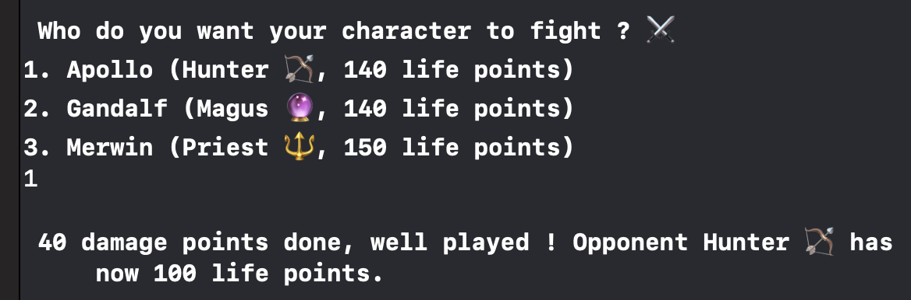

Then, second player choose which character he wants to play with :

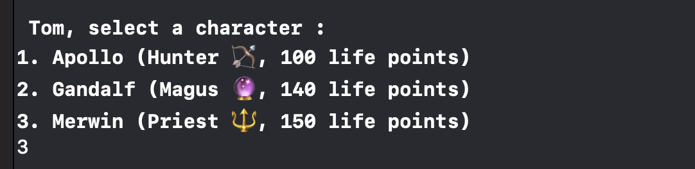

If the character chosen by the player is a Priest, then the player will choose  between its own team members which one to heal :

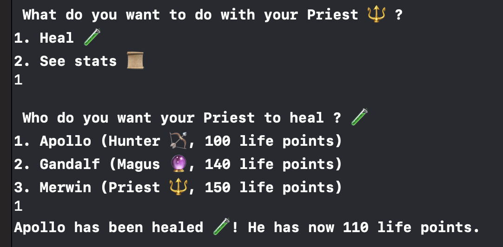

And so on, until one team has no more damage dealer alive.
Then, a message appears to announce the winner :

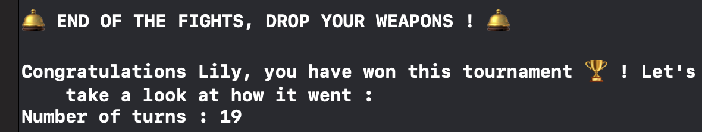

And the game stats for each players :

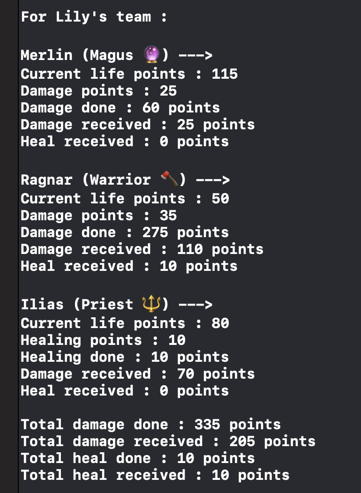

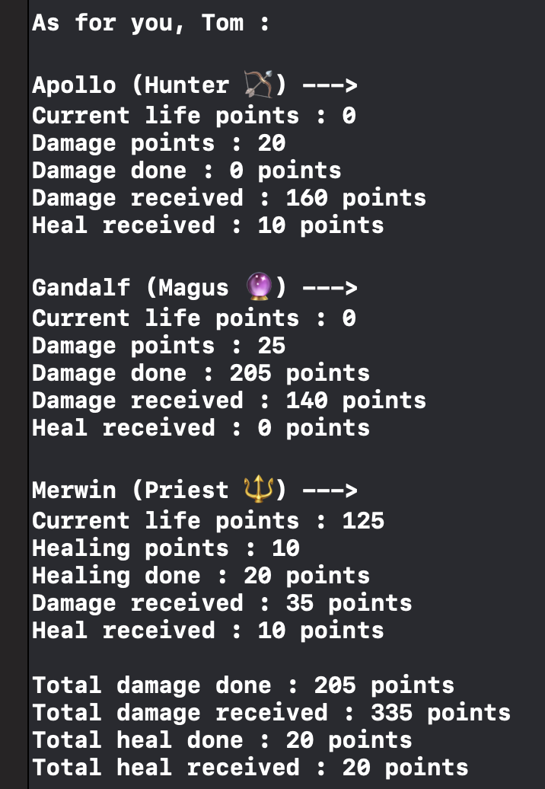

Finally, a message appears and the program stops :

> Written with [StackEdit](https://stackedit.io/).
